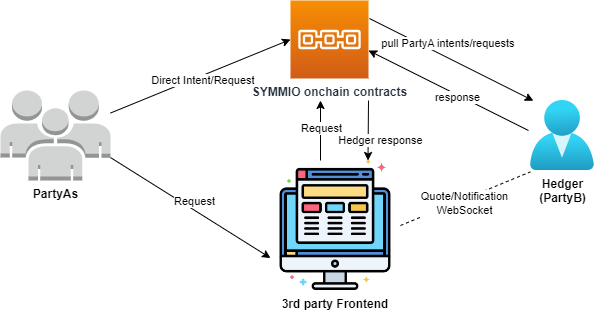
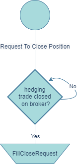

# Glossary and Clarifications

**The term "Hedger" is referred to a MarketMaker that provides Liquidity on SYMMIO.**  
more information can also be found on Gitbook [https://docs.symm.io ](https://docs.symm.io/building-on-symm-io/liquidity-providers-hedgers)

**Scope and Perspective:**
This documentation is curated from the perspective of an "example hedger" that adopts a precise 1:1 hedging strategy. This Strategy ensures that this "example hedger" remains delta neutral at every point in time, eliminating any directional exposure.
This approach should be interpreted as an example and not as an absolute when interacting with the SYMMIO system, every MarketMaker has full control to, at any point when interacting with the core protocol, design his own hedging strategy,  or not hedge at all.
But the SYMMIO protocol is specifiically designed in a way that gives MarketMakers the time and ability to hedge their trades comfortably if they decide to do so.

**Operational Context:**
When this "example hedger" initiates a trade on SYMMIO, they directly open a direct countertrade on their chosen broker platform (for instance, Binance) before filling the order onchain. A unique aspect of this strategy is its sequential nature: a trade is only filled onchain when its hedging counterpart is confirmed, and conversely, it's only closed after the hedging trade is conclusively settled.

**Documentation Purpose:**
This liquidity provision strategy and the ensuing documentation serve as a template for what can be perceived as the lowest risk profile attainable in the hedging arena.
However, a note of clarity: while this approach is streamlined and minimizes risks, we recognize it's somewhat rudimentary. 
Veteran market makers, armed with profound expertise, may devise intricate strategies that could potentially yield heightened profits, 
the SYMMIO system gives MarketMakers one hundred percent control over the hedging strategy they want to apply.
Any segments of this documentation that could be interpreted differently should be perceived purely as guidelines. 
They document aims to explain how a basic strategy could be seamlessly implemented, but in no way restrict or limit the development of other strategic avenues one might pursue.

## Additional Disclaimer - SYMMIO core systems and Hedger relationship

**Educational Use:** This Hedger documentation is crafted with a singular goal in mind: to provide a fundamental understanding of the hedger's role in the SYMMIO system to it's readers. (MarketMakers, Investors and everyone who is interested in becoming a Hedger himself) 
The Hedger documentation is educational and not a comprehensive reflection of the entire Symmio protocol. It is structured to provide an introductory grasp of what it means to be a hedger and offers a primer on how one can undertake this role. 

**Misconceptions:** Some readers might have concluded that the Symmio system depends on MarketMakers hedging themselves, leading to assumed trust dependencies on the MarketMaker side or that user funds and hedger funds are somehow dependent on off-chain brokers or results of hedging strategies. However, this understanding needs to be revised and could lead to erroneous interpretations of the system's architecture.  

**Top-Down Relationship:** To reiterate and clarify, the relationship between a Hedger and the Symmio protocol is top-down. That means whatever actions a hedger takes off-chain have no bearing on the on-chain events. Thus, there are no trust assumptions regarding the hedger side of things as they use off-chain systems to hedge themselves or the connection between these off-chain systems and SYMMIO itself.  

**Independent On-Chain Contracts:** The Symmio contracts function independently of any off-chain actions a hedger performs. They operate exclusively within the on-chain environment and are not influenced or impacted by external actions.
The SYMMIO system is fully isolated from any issues that may or may not arise in combination with MarketMakers and the off-chain systems, centralized exchanges, trading desks, or any other forms of hedging they use.
We strongly recommend readers to familiarize themselves with these points to understand Hedger's role and its interaction with the Symmio protocol. It's essential to interpret the Hedger section in light of these clarifications to avoid misrepresentations of the Symmio protocol's actual functioning.

### Broker definition
Within the scope of Hedger's documentation, the term "Broker" holds a specific connotation, distinct from conventional interpretations. Let’s elucidate that.
When the term "Broker" is mentioned in the context of being a Hedger on SYMMIO, it is being referred to as a general "hedging strategy" that a MarketMaker (MM) can optionally design to hedge their SYMMIO trades. Importantly, it's vital to understand that our system doesn't necessitate a MarketMaker to hedge their trades. In fact, it's entirely optional. However, we've architected SYMMIO in such a way that if a MarketMaker decides to hedge, the system allows you to do so easily, it's entirely designed to make it simple and straightforward.

Broad Application of the Term
The term "Broker" is expansive in our context. It can encompass:

Centralized Exchanges (CEX)
Decentralized Exchanges (DEX)
Over-The-Counter (OTC) Desks
Spot holdings
Any other hedging strategies, whether they exist on-chain or off-chain.

A Note on Hedging Strategies
We don’t categorize or prioritize one method of hedging over another. All are viewed through the same lens, and are designed by MarketMakers themselfs to be delta neutral or not, the system is designed to offer MarketMakers the potential to optimize their efficiency infinitely. 
Moreover, we acknowledge that the realm of hedging is vast, with potentially limitless strategies and methods for securing a position. Thus, when you come across "Broker" in our documentation, remember that it speaks to this broad, encompassing perspective.

# How To Implement Your Own Hedger For SYMMIO

## 1. Introduction

The Symmetrical platform offers traders the opportunity to engage in permission-less derivatives trading on the blockchain. There are two types of traders on this platform:

1. PartyA: They post requests for trades, also known as Intents.
2. PartyB (hedgers, market makers): They respond to the requests made by PartyA, by claiming the Intent.

From now on we will refer to PartyB or MarketMaker as "Hedger" as well as the Software to Market make as "hedging software", anything that offers quotes & accepts intents in the SYMMIO ecosystem is referred to "Hedger", and the strategy to Market make on SYMMIO is referred to as "hedging", even tho it is not required to be delta neutral at all times.

Each PartyB has the freedom to adopt their own hedging strategy, they can also choose to not hedge at all and be directionally exposed. However, certain rules are in place to ensure fairness within the system. In order to develop a customized MarketMaking approach, it is crucial to understand the timeline of Intents, the various requests made by PartyA, and the potential scenarios that may arise as a result of PartyA's actions. This document aims to focus on these aspects to assist you in building your own hedger.

The main connection between PartyA and PartyB is based on onchain contracts. 
Consequently, it is essential for each hedger to be able to monitor requests made by PartyA on the blockchain. 
This can be achieved by utilizing a subgraph or event-listener. 
Moreover, it is imperative for the hedgers to respond to these requests via onchain calls to the SYMMIO core contracts.

Additional connections are established between PartyA and the hedgers through the front-end interface, 
Hedgers stream current quotes as Bid and Ask to frontends as well as funding, 
collateral requirements but also simple notifications to enhance UX can be streamed via websocket connections. 
These connections aim to enhance the user experience by updating users on the status of their positions and intentions, 
as well as decreasing the time from request to execution by streaming quotes upfront. 
For example, a hedger might notify the user when their request has been viewed, 
indicate the percentage of limit orders that have been filled, 
confirm if a transaction has been conducted in response to the user's request, 
or explain the reasons for rejecting the user's request. 
These types of connections are entirely optional. 
Each hedger may choose whether or not to provide this kind of information, 
and the platform itself does not validate the contents of such communications. 

In our current frontend architecture streaming quotes on the other hand is not optional and every hedger should stream his offers upfront to a frontend in order to enable fast executions and CEX like UX.

## Figure1 shows how PartyAs and Hedgers are communicate.

    **Figure 1: Different types of communication of hedger (PartyB) and PartyA**

Intents are the heart of the system so we need to get familiar with the lifecycle of an intent before going any further. Figure 2 illustrates the lifecycle of an intent. The dashed arrows represent actions taken by the hedger, and the solid arrows represent actions taken by Party A or a third party. The circles indicate the state of the intent.

    **Figure 2: Lifecycle of Intent**

## 2. Send Intent (Send Quote)

Let's start with where an intent gets born and see what parameters are inside an intent (current SYMM version 0.8, Intents could be completly customized to offer other products like Options, Expiring Swaps etc). 
In the following table, we describe each field of a intent that is provided by a user during their request for a intent.

**Table 1: Structure of an Intent**

| Field            | Description                                                                                                                          |
| ---------------- | ------------------------------------------------------------------------------------------------------------------------------------ |
| partyA           | The address of the user who made the request                                                                                         |
| quoteId          | The unique identifier of the quote, which must be referenced in all further requests                                                |
| partyBsWhiteList | The whitelist of the hedgers who are allowed to take action upon this intent. If it is empty, it means that all hedgers are allowed |
| symbolId         | The symbol identifier of the symbol that the user has sent ab intent for                                                            |
| positionType     | The position type: LONG or SHORT (It would actually be 0 and 1 in the data)                                                          |
| orderType        | The order type: Limit or Market (It would actually be 0 and 1 in the data)                                                          |
| price            | The price that the user has requested                                                                                                |
| quantity         | The quantity of the requested position                                                                                               |
| cva              | In case of liquidation, this is a penalty that the liquidated side of the trade must pay to the other side                          |
| mm               | The maintenance margin of this intent                                                                                                |
| lf               | The liquidation fee which is going to be paid to the liquidator                                                                      |
| deadline         | Specifies the period in which hedger is allowed to open this position                                                             |

### 2.1. Limit request

The diagram below provides a detailed visualization of the potential steps a hedger might undertake upon receiving notification of a Limit request dispatched by PartyA

    **Figure 3 hedger Actions after SendQuoteLimit**

Upon seeing a request made by PartyA, hedgers should first check if they are whitelisted, meaning the user whitelisted the hedgers address as intent parameter & they are therefore allowed to act upon the request. After this, there's a race among hedgers to be the first to lock(claim) the Intent. The hedger who locks the intent first will have the opportunity to open the position. Thus, the hedger should to review the intent to ensure it aligns with their policies and is "interesting" enough to be opened, this is an additional security measure no onchain derivatives plattform in crypto can offer market makers. 
If the intent is interesting and matches hedger policies, and they have sufficient allocated balance with the corresponding PartyA, they should immediately lock it by calling the "lockQuote" function. 

If they lack the necessary allocated balance, they should call the "AllocateAndLock" function to promptly execute both actions in a single transaction. Subsequently, the hedger can hedge the position with a broker, any OTC desk or exchange and then use the "openPosition" function or simply wait until the price reaches the desired level before calling "openPosition"

### 2.2. Market request

The diagram below shows a hedger's actions after spotting a market position

    **Figure 4: hedger action after send Intent(market) **

Market requests are similar to Limit ones. However, there are two differences in the actions taken by the hedger for this type of Intent. Firstly, hedgers must check the deadline of the Intent to determine if there is enough time to open a hedging position. Secondly, they can call "LockAndOpen" and "AllocateLockAndOpen" instead of "Lock" and "AllocateAndLock".

### 2.3. Opening the position

After the steps mentioned, the hedger should call the 'openPosition' function with the specified parameters:

1. quoteId: The ID of the pending Intent that the hedger wants to fill.
2. fillAmount: The hedger has the option to open only a fraction of the specified Intent amount. Whatever quantity remains unfilled will be reposted as a new intent in the system.
3. openedPrice: The average fill price for the Intent which should not exceed the price specified by the user. The Unrealized Profit and Loss (UPNL) are determined based on this price.
4. Oracle Signature for Both Parties' UPNL: This signature is essential to evaluate the solvency of both parties after contract execution. The contract strictly forbids hedgers from initiating a position if it would lead to the liquidation of either party. Consequently, hedgers must carefully track the solvency ratio of parties with whom they have pending positions. If a pending inent appears to be no longer economically sustainable for any party, they should immediately cease the related processes to avoid further losses.

### 2.4. Expiration of an intent before being claimed and executed and becoming a position

An intent can become expired or cancelled before turning into a position.

#### 2.4.1. Expiration

Each intent has an expiration time assigned. For limit orders, the expiration time is automatically set to infinite during payload creation in the front-end (good practice for frontends). If the hedger fails to open a position within the specified time frame, they will no longer be able to open it, and a third party or partyA may choose to let the intent expire. If such a case happened the hedger should cancel its corresponding hedging position on the broker side to avoid being directionally exposed.

#### 2.4.2. Cancellation

If PartyA decides to cancel a pending intent that is not locked(claimed) by any hedger, the intent will be immediately canceled. However, if PartyA chooses to cancel an already locked intent, the corresponding hedger is given a specific period, known as the "forced cancellation cooldown." During this time, the hedger must either accept the cancellation request or proceed with executing the intent, converting it into a position. The diagram below outlines the actions a hedger should take upon receiving a cancellation request for a previously locked intent.

    **Figure 5: Different Actions Taken by the Hedger for Canceling an Intent**

##### 2.4.2.1. Forced Cancellation of Intent

If the hedger doesn't respond to a cancellation request for an intent, either Party A or any third party can forcefully cancel the intent after the "forced cancellation cooldown" period expires. Should this occur, the hedger must cancel the corresponding position on the broker side.

## 3 Closing the position

This section explains the different ways in which users can close a position and the steps required for hedgers to respond to them respectively

### 3.1. Limit close request

Figure 5 depicts a flowchart detailing the sequential actions required by a hedger upon receiving a limit close request from Party A.

    **Figure 6: Hedger Action on Party A's Limit Close Request**

Upon receiving a request from Party A to close a position at a limit, the corresponding hedger should either submit this request to a broker or continuously monitor the price. When the price reaches the desired level or the close request from the broker's side is fulfilled, the hedger should proceed with the closure. It's vital to note that if the hedger fails to fulfill the close request after the price hits the specified level, the position may be force-closed.

#### 3.1.1. Force Close

To prevent Party B from neglecting to fulfill limit close requests, the SYMMIO contract has integrated the Force Close function. When the price of a limit close request is met, Party B is given a specific period (Force Close Cooldown) to act on the close request. If they don't, a third party will initiate a forced closure. As a result, the hedger will face a penalty, payable to the party that triggers the force close. In such scenarios, if hedging activities are in place, Party B may close the corresponding position on the broker side.

### 3.2. Market close request

Market close requests operate in a manner similar to market intent requests, given their specific time frame leading up to expiration, with the requested price determined by the prevailing market price. Figure 6 depicts the procedures a hedger should adhere to when handling a market request for closure.

    **Figure 7: Hedger Action During a Filled Close Request Market**

### 3.3. Filling the close request

After the steps mentioned, the hedger should call the 'fillCloseRequest' function with the specified parameters:

1. quoteId: The unique identifier of the respective position.
2. fillAmount: The hedger can fill the close request in multiple steps, each with a fraction of the user's requested amount.
3. closedPrice: The average closing price of the position (cannot be lower than the user's requested price).
4. Oracle Signature for Both Parties' UPNL: This UPNL signature represents both parties and is used for solvency checks on the contract side. A hedger cannot close a position if such closure would lead to either party facing liquidation. Although such situations, indicative of a problem with the liquidator, are rare, specific actions are in place. If Party A has a solvency issue, the hedger is permitted to liquidate the user. Conversely, if the solvency challenge is on the hedger's side, they must deposit additional funds into their account to avert liquidation.

### 3.4. Death of a close request

A close request can get expired or cancelled before actually getting filled by the hedger.

#### 3.4.1. Expiration

Close requests come with a designated time frame for fulfillment, as specified by the 'deadline' parameter. If not filled within this period, the close request becomes unfulfillable, and the position's status reverts to “open”.

#### 3.4.2. Cancellation

If PartyA changes their mind after submitting a close request, they are allowed to cancel it by initiating a "cancel close request" action. The hedger must respond within a certain timeframe by either fulfilling the close request or accepting the cancellation. Figure 7 illustrates the potential actions taken by the hedger upon receiving a cancel close request.

    **Figure 8: Actions taken by the hedger in response to a cancel close request**

###### 3.4.2.1. Force Cancel Close Request

If the hedger fails to respond to the cancel close request within the force cancel close cooldown period, any third party is authorized to perform a force cancel close. In this scenario, the position status reverts back to "open" and the hedger must cancel and undo their close request on the broker's platform.

## 4. Parties' Liquidation

If any party is liquidated during the position, the position is no longer valid, and the hedger has the option to close and cancel the corresponding hedger's close request on the broker side.

## 5. Summary of different Type of Requests made by PartyA

Table 2 provides a comprehensive summary of various request types available for PartyA within the system and delineates how hedgers should  address them.

**Table 2: Description of different requests of PartyA**

|       Request Type       | Summary                                                                                                                                                                                                                                                                                                                                                              |
| :----------------------: | :------------------------------------------------------------------------------------------------------------------------------------------------------------------------------------------------------------------------------------------------------------------------------------------------------------------------------------------------------------------- |
|    Send Quote (limit)    | When PartyA wishes to make a limit trade on a symbol, they can make a  request for a Intent by calling sendQuote and providing the required  information such as price, quantity, MM, CVA, LF.                                                                                                                                                                       |
|   Send Quote (Market)   | Similar to limit orders, but in this type of trade, the front-end  requests the price with a slippage based on the current market price and a limited expiration time. This gives the hedger a specific deadline to fill such requests. Additionally, partial fills are not allowed in this type of request.                                                         |
|    Request To Cancel    | This type of request may occur when PartyA wants to cancel their  unfilled quotes. If no hedger has locked their request, the request to  cancel will be immediately accepted. However, if their quote has been  locked by a hedger, the hedger has a certain amount of time (force  Cancel cool down) to either fill their quotes or accept their cancel  requests. |
| Request To Close (limit) | When a user wants to close their request, they must make a close request and provide information such as the quantity they want to close and the price.                                                                                                                                                                                                              |
| Request To Close(Market) | Similar to the market request for a quote, this type of request for closure is the same as requesting a close, but with a price that  includes slippage and an expiration time. In this type of request,  requesting a market close for a part of a quote and partial filling the  close request is not meaningful.                                                  |
| Request To Cancel Close | After each PartyA makes a request to close, they are allowed to cancel  their close request before the hedger fills it. Similar to the request  to cancel, the hedger has a certain amount of time to respond to such  requests, or the cancel close requests will be forced.                                                                                        |

In addition, there are various other types of events that the hedger must be mindful of, as they can have consequences on their business. Table 3 summarizes these additional events.

**Table 3: additional type of events**

| Event              | Functor    | Description                                                                                                                                                                                             |
| ------------------ | ---------- | ------------------------------------------------------------------------------------------------------------------------------------------------------------------------------------------------------- |
| Force Cancel       | Any One    | If the hedger fails to respond to the user's cancel request within a  certain time frame, any authorized individual is allowed to call for a  force cancel, rendering the quote unavailable thereafter. |
| Force Cancel Close | Any One    | Similar to force cancel, but applicable for close requests.                                                                                                                                             |
| Force Close        | Any One    | If the hedger does not fulfill the user's close request even after the  price has been reached, any authorized individual can force close the  request by providing a signature confirming the event.   |
| Expire Quote       | Any One    | If the hedger does not fill the market request, it will expire.                                                                                                                                         |
| Liquidate User     | Liquidator | If the hedger or user's allocated balances are unable to cover their  Unrealized Profit and Loss (UPNL), they will be subject to liquidation.                                                           |
| Liquidate Position | Liquidator | After liquidating the user, the liquidator will proceed to liquidate  each position and facilitate a settlement between the parties involved.                                                           |

## 6. Notification Web-Socket

Due to a delay in contracts and various events such as the filling of a position or the rejection of a request by the hedger, the SYMMIO front-end is capable of displaying these notifications to the user in real time. The following information describes the current types of notifications within the current notification system, but if any hedger requires additional types of notifications, please feel free to inquire.

**Table 3: Different Types of Notifications**

| Notification                                                                | State Type | Action Status | Additional Fields to be Sent                                 |
| --------------------------------------------------------------------------- | ---------- | ------------- | ------------------------------------------------------------ |
| Filling status of intent limit                                              | report     | *             | filled_amount_open, quote_id, counterparty_address           |
| Filling status of closing order limit                                       | report     | *             | filled_amount_close, quote_id, counterparty_address          |
| Notification when the hedger has viewed a request                           | alert      | seen          | last_seen_action, quote_id, counterparty_address             |
| Notification when the hedger successfully responds to a request from PartyA | alert      | success       | last_seen_action, quote_id, counterparty_address             |
| Notification when the hedger rejects a request from PartyA                  | alert      | failed        | error_code, last_seen_action, quote_id, counterparty_address |
