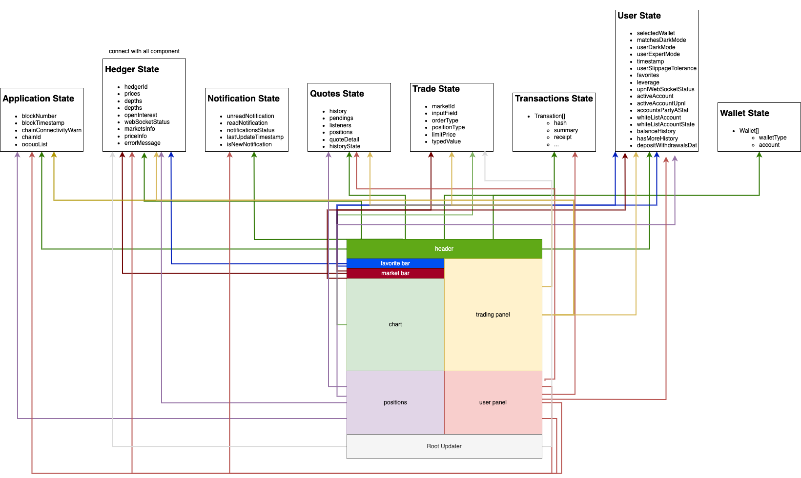

# SYMM Interface

This project serves as an interface for our trading platform, enabling users to execute trades seamlessly. It offers features for account management as well as options for depositing and withdrawing funds.

## Prerequisites

- Node.js
- yarn

## Installation & Running Locally

1. Clone the repository `git clone https://github.com/maliabr/core-interface`
2. Navigate into the directory `cd core-interface`
3. Install dependencies `yarn install`
4. Run the project `yarn dev`

## Folder Structure

This is the folder structure. We will explain the contents of each folder in the following.

- /src

  - /apollo
    - In our codebase, GraphQL queries and interactions are primarily managed within the apollo folder. This serves as the centralized location for defining queries and establishing communication with the GraphQL server."
  - /callbacks
    - Sensitive functions such as Trade, OpenPosition and ClosePosition are encapsulated within callback-style custom hooks. These hooks implement the core logic for each respective operation
  - /components
    - The components folder in our React app houses reusable UI elements and their logic. Components are organized into sub-folders by functionality. This modular structure aids in code readability and reusability.
  - /config
    - The config folder holds parameters for altering the website's UI and functionality.
  - /connection
    - The connection folder contains the logic and interfaces for establishing connectivity with Web3 and various wallets.
  - /constants

    You'll most likely interact with the /constants directory if you intend to modify our codebase, as it centralizes the configuration parameters and static variables affecting the application's behavior.

    The constants folder acts as a single source for critical blockchain-related data. It includes contract addresses and their corresponding ABIs, parameters unique to different blockchain chains, and token-specific information. Additionally, it houses details about various Web3 providers for network interactions, as well as addresses and other relevant information pertaining to Hedger services. In the sections below, we elaborate on the specifics of each file and directory:

    - /abi: This folder serves as the storage location for the Application Binary Interface (ABI) of each smart contract utilized within the website. The ABIs are saved in JSON format, making them easily accessible for encoding and decoding data. Whenever you integrate a new contract or update an existing one, make sure to upload the corresponding ABI here to maintain full functionality.

    - addresses: This file contains profile objects for each smart contract. The keys indicate the chainId, and their corresponding values specify the contract's address on that particular blockchain.

    - chaininfo: Within our platform, this file offers comprehensive data for each supported blockchain. This includes essential attributes such as the chain ID, native currency, and RPC URL, to provide context and functionality for each chain.

    - chains: This variable contains information about both the supported mainnet and testnet blockchains.

    - hedgers: Stores communication data for hedgers as well as corresponding data maps. Useful for managing risk and implementing hedging strategies within the platform.

    - misc: This is a repository for general constant variables related to the application, including settings like default_precision, market order deadline,balance history item number, and max pending position number. These variables have platform-wide implications for calculations and user interactions.

    - networks: This file declares the RPC URLs to be used when a wallet is not connected to the system. It serves as a fallback mechanism to maintain functionality under various connectivity conditions.

    - popup: Manages the configuration settings for popup notifications or messages within the platform. Use this file to control the display behavior and content of popups.

    - providers: this file handles multi-network support and caching. It boosts efficiency by caching recurring eth_call requests and initializes instances for multiple Ethereum-compatible chains. To incorporate a new network into your website, make modifications to this file.

    - tokens: As a central repository for token-related data, this file stores specifics on Wrapped Native Currencies, Token Shorthands, and Collateral Tokens. If you're looking to extend or manage the types of tokens supported by the system, this is your go-to file for making those updates.

  - /hooks
    - The hooks folder contains individual files for each custom hook, consolidating all custom logic in one location.
  - /lib

    The lib folder is where we manage interfaces for interacting with third-party DeFi applications, such as Muon. In the sections below, we elaborate on the specifics of each file and directory:

    - /hooks:
      This directory contains stable hooks that facilitate interaction with third-party libraries and DeFi protocols.
      - /transactions: This file acts as an updater for transactions and their associated receipts, specifically designed to manage the asynchronous receipt of transaction confirmations.
    - /muon: This directory houses configuration files and interfaces required for seamless communication with the Muon DeFi protocol.
    - state: This file coordinates interactions with Uniswap's Multicall library, as well as manages the application's global state.

  - /pages
    - The pages folder is responsible for defining the routing structure of the Next.js application. Each file within this folder automatically becomes a route, allowing for seamless navigation and URL management
  - /state
    - The state folder contains reducers and hooks for Redux-based state management, as well as updaters for modifying the Redux store.
  - /theme
    - The theme folder defines variables and settings related to the application's color schemes and overall visual theme.
  - /types
    - The types folder contains TypeScript type definitions used throughout the application for strong typing and enhanced code quality.
  - /utils
    - The utils folder houses utility functions and helper scripts that provide reusable logic and operations across the application.

- /public
  - The public folder serves as a storage location for static assets such as images, fonts, and other files. These assets are accessible via the root URL path and do not undergo Webpack processing
- /doc
  - The doc folder contains documentation files that outline the architecture and functionality, providing essential guidelines and references for the development team.
- yarn.lock
- README.md

## Technologies & Libraries Used

The essential libraries you need to be familiar with to contribute to this project are:

- React
- Typescript
- NextJs
- Styled-components
- Redux
- Reduxjs/toolkit
- Axios
- Apollo
- Web3-react
- Uniswap/redux-multicall
- Bignumber.js
- Graphql

## Components

- NavBar: Displays the header section.
- FavoriteBar: Display the user-selected favorite pair.
- MarketBar: Allow users to select the pair of tokens for the website. All components of the website are based on this selected token pair. Also, display statistics for the selected pair of tokens.
- Chart: Display real-time price data for the chosen token pair, featuring an interactive interface for historical analysis and charting tool access.
- TradePanel: This area offers a general suite of trading tools for users.
- User Panel: This section displays real-time positions, recent activity related to those positions, and a history of past positions.
- User Panel: This section displays real-time positions, recent activity related to those positions, and a history of past positions.
- AccountBalance: Displays a breakdown of various balances, including allocated balance, locked balance, and locked margin.
- Balance History: Showcases a detailed record of account deposits and withdrawals
- Markets: Displays an array of tradable market pairs on this website, complete with the latest pricing, 24-hour fluctuations, and trading volume.

## State Management

We employ Redux and the Context API for state management. In the following sections, we'll outline the state variables managed by Redux, as well as those stored using the Context API.

Contex API variable:

- web3Provider: Stores the connector, chainId, and accounts.
- themeProvider: Manages theme-related attributes, including activeTheme, z_index, and mediaWidth.
- modalProvider: Handles the state for open modals and background components.
- blockNumberProvider: Stores the latest block number for the selected chain.

Redux state:

- applicationState: Manages various app-related data, including blockNumber, blockTimestamp, chainId, openModal, and popupList.
- connectionState: Stores any wallet connection errors.
- hedgerState: Manages data specifically related to the hedger, including attributes like tokenPrices, marketList, webSocketStatus, marketNotionalCap, and hedgerErrors.
- notificationState: Manages notification-related data, including readNotifications, unreadNotifications, and lastUpdateNotification.
- quoteState: Manages data related to open positions, commonly referred to as 'quotes' in our system, capturing real-time status and attributes related to user positions
- TradeState: Manages data for the trading component, including user input fields and related attributes.
- transactionState: Maintains records of user transactions, categorized by individual blockchain chains.
- userState: Manages a comprehensive dataset related to user activities, including account balance, whitelist status, recent contract interactions, unrealized and realized PNL, preferred markets, and balance history.
- walletState: Store connected wallet

## Redux State and React Component Relationship Diagram

This image shows how the component and state are connected, with traceable lines for easy tracking

## Most used Hooks

In our application, we frequently utilize a set of custom hooks to streamline various functionalities. Becoming familiar with these hooks will provide a deeper understanding of the app's core operations.

- useActiveWeb3React: Returns the active account, chain ID, provider, and connector.
- useSupportedChainId: Verifies whether the active chain ID is supported.
- useMarket: Retrieves the marketId and returns relevant market information.
- useActiveMarket: Returns information about the currently active market on the website.
- useTradePage: Provides stored variables related to the trade section, such as balance and user-inputted amounts.
- useWebSocketStatus: Checks the status of the WebSocket connection.
- useIsAccountWhiteList: Verifies if the active account is included in the whitelist.
- useActiveAccountAddress: Returns the active user's account address.
- useQuoteDetail: Returns selected quote information.
- useSingleContractMultipleMethods: Executes multiple methods within a single contract using multicall.

## Environment Variables

Create a `.env` file in the root directory and add the following:

- NEXT_PUBLIC_GOOGLE_ANALYTICS_ID=""
- NEXT_PUBLIC_INFURA_KEY= ""

## Contribution Guidelines

1. Fork the repository
2. Create your feature branch (`git checkout -b feature/fooBar`)
3. Commit your changes (`git commit -am 'Add some fooBar'`)
4. Push to the branch (`git push origin feature/fooBar`)
5. Create a new Pull Request`
